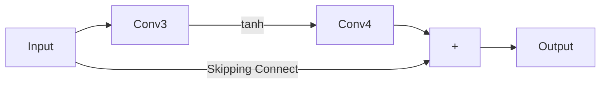
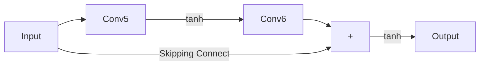
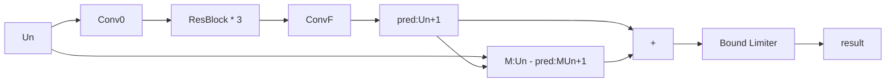

三阶Crank-Nicolson格式即其与JuLiLi论文的结合
====================

三阶时间差分格式:
---------

考虑等距分布的时间差分的函数值:${u^{n + 1}},{u^n},{u^{n - 1}}​$,假设其在${t^{n - 1 + \alpha }}​$处存在Taylor展开式:

其中$\alpha \in (1,2)$表示时间区间$[t^{n},t^{n+1}]$上的某一个点;

$$
\begin{equation}
\begin{split}
{{u^{n + 1}} = {u^{n - 1 + \alpha }} + \left( {2 - \alpha } \right)\tau \frac{{\partial u}}{{\partial t}}\left( {{t^{n - 1 + \alpha }}} \right) + \frac{{{{\left( {2 - \alpha } \right)}^2}}}{2}{\tau ^2}\frac{{{\partial ^2}u}}{{\partial {t^2}}}\left( {{t^{n - 1 + \alpha }}} \right) + \frac{{{{\left( {2 - \alpha } \right)}^3}}}{6}{\tau ^3}\frac{{{\partial ^3}u}}{{\partial {t^3}}}\left( {{t^{n - 1 + \alpha }}} \right) + o\left( {{\tau ^4}} \right);} \\
{{u^n} = {u^{n - 1 + \alpha }} + \left( {1 - \alpha } \right)\tau \frac{{\partial u}}{{\partial t}}\left( {{t^{n - 1 + \alpha }}} \right) + \frac{{{{\left( {1 - \alpha } \right)}^2}}}{2}{\tau ^2}\frac{{{\partial ^2}u}}{{\partial {t^2}}}\left( {{t^{n - 1 + \alpha }}} \right) + \frac{{{{\left( {1 - \alpha } \right)}^3}}}{6}{\tau ^3}\frac{{{\partial ^3}u}}{{\partial {t^3}}}\left( {{t^{n - 1 + \alpha }}} \right) + o\left( {{\tau ^4}} \right);} \\
{{u^{n - 1}} = {u^{n - 1 + \alpha }} + \left( {0 - \alpha } \right)\tau \frac{{\partial u}}{{\partial t}}\left( {{t^{n - 1 + \alpha }}} \right) + \frac{{{{\left( {0 - \alpha } \right)}^2}}}{2}{\tau ^2}\frac{{{\partial ^2}u}}{{\partial {t^2}}}\left( {{t^{n - 1 + \alpha }}} \right) + \frac{{{{\left( {0 - \alpha } \right)}^3}}}{6}{\tau ^3}\frac{{{\partial ^3}u}}{{\partial {t^3}}}\left( {{t^{n - 1 + \alpha }}} \right) + o\left( {{\tau ^4}} \right);}
\end{split}
\end{equation}
$$

那么假设存在${u^{n + 1}},{u^n},{u^{n - 1}}$的一个线性表出,使得(1)中形成一个:

$$
\begin{equation}
span\left\{ {{u^{n - 1}},{u^n},{u^{n + 1}}} \right\} = \lambda \left( \alpha  \right)\tau \frac{{\partial u}}{{\partial t}}\left( {{t^{n - 1 + \alpha }}} \right) + o\left( {{\tau ^4}} \right) \tag{2}
\end{equation}
$$

的状态;

等价于下列齐次线性方程组存在非平凡根:

$$
\begin{equation}
\begin{bmatrix} 1 & 0 & 0 \\ 0 & \frac{\tau^2}{2} & 0 \\ 0 & 0 & \frac{\tau^3}{6} \end{bmatrix}
\begin{bmatrix} 1 & 1 & 1 \\ (2-\alpha)^2 & (1-\alpha)^2 & (0-\alpha)^2 \\ (2-\alpha)^3 & (1-\alpha)^3 & (0-\alpha)^3 \end{bmatrix}
\begin{bmatrix} \chi \\ \beta \\ \gamma \end{bmatrix} = \bf{0}
\tag{3}
\end{equation}
$$

因此(3)的核空间完全取决于$\alpha$所在的矩阵的行列式,因此计算得到其有两个根:

$$
\begin{equation}
\alpha  = 1 \pm \frac{{\sqrt 3 }}{3} \tag{4}
\end{equation}
$$

这两个根都有用,因为对于一个初值问题,我们只知道$u^{0}$,而不知道$u^{1},u^{2}$,那么按照离散化的方程(组)在这两点成立,联立方程解出这两个值才能保证对应的三阶精度.且在这两点都搞定以后,后面每一步只需要求解较大根了.

根据我们的假设,选取较大的根,并且我们断言:

$$
\begin{equation}
\left( {2 - \alpha } \right)\chi  + \left( {1 - \alpha } \right)\beta  + \left( {0 - \alpha } \right)\gamma  \ne 0
\tag{5}
\end{equation}
$$

如若不然,则下面的方程成立:

$$
\begin{equation}
\begin{bmatrix} 1 & 1 & 1 \\ (2-\alpha) & (1-\alpha) & (0-\alpha) \\ (2-\alpha)^2 & (1-\alpha)^2 & (0-\alpha)^2
\end{bmatrix}
\begin{bmatrix} \chi \\ \beta \\ \gamma \end{bmatrix} = \bf{0}
\tag{6}
\end{equation}
$$

即一个范特蒙德矩阵存在非平凡齐次解,那么必须满足其中的:$2 - \alpha ,1 - \alpha , - \alpha $存在相等的情况,显然这是不行的.

因此我们得到了一个三阶数值格式:

$$
\begin{equation}
\frac{{\chi {u^{n + 1}} + \beta {u^n} + \gamma {u^{n - 1}}}}{{\left[ {\left( {2 - \alpha } \right)\chi  + \left( {1 - \alpha } \right)\beta  + \left( {0 - \alpha } \right)\gamma } \right]\tau }} = \frac{{\partial u}}{{\partial t}}\left( {{t^{n - 1 + \alpha }}} \right) + o\left( {{\tau ^3}} \right)
\tag{7}
\end{equation}
$$

那么对于空间差分时,只要获得某点的函数值的近似而不需要考虑关于时间导数的近似,因此容易多了,也即找出上述的${u^{n + 1}},{u^n},{u^{n - 1}}$的一组线性标出能够使得时间一阶导数和二阶导数系数为0即可:

$$
\begin{equation}
\begin{bmatrix} 1 & 0 & 0 \\ 0 & \tau & 0 \\ 0 & 0 & \frac{\tau^2}{2} \end{bmatrix}
\begin{bmatrix} 1 & 1 & 1 \\ (2-\alpha) & (1-\alpha) & (0-\alpha) \\ (2-\alpha)^2 & (1-\alpha)^2 & (0-\alpha)^2 \end{bmatrix}
\begin{bmatrix} \chi \\ \beta \\ \gamma \end{bmatrix} = 
\begin{bmatrix}  \ne 0 \\ 0 \\ 0 \end{bmatrix}
\tag{8}
\end{equation}
$$

注意到这里求解时首先把(8)看出两个方程:

$$
\begin{equation}
\begin{bmatrix} 1 & 0 & 0 \\ 0 & \tau & 0 \\ 0 & 0 & \frac{\tau^2}{2} \end{bmatrix} \xi = 
\begin{bmatrix} \ne 0 \\ 0 \\ 0 \end{bmatrix}; \\
\begin{bmatrix} 1 & 1 & 1 \\ (2-\alpha) & (1-\alpha) & (0-\alpha) \\ (2-\alpha)^2 & (1-\alpha)^2 & (0-\alpha)^2 \end{bmatrix}
\begin{bmatrix} \chi \\ \beta \\ \gamma \end{bmatrix} = \xi;
\tag{9}
\end{equation}
$$

也即得出$\xi$是和$\tau$无关的量,且第一个元素要求是非零元;

那么假设这个非零元就是1,那么由于第二个方程的系数矩阵是范特蒙德矩阵,因此解存在唯一.

为了不引起混淆,我们记(9)的唯一解为$\left( {\lambda ,\mu ,\eta } \right)$

因此就以热方程为例,下面的BDF-2格式是时间三阶方法:

$$
\begin{equation}
\frac{{\chi {u^{n + 1}} + \beta {u^n} + \gamma {u^{n - 1}}}}{{\left[ {\left( {2 - \alpha } \right)\chi  + \left( {1 - \alpha } \right)\beta  + \left( {0 - \alpha } \right)\gamma } \right]\tau }} + {\Delta _h}\left( {  \lambda {u^{n + 1}} + \mu {u^n} + \eta {u^{n - 1}}} \right) = 0
\tag{10}
\end{equation}
$$

(10)中:

$$
\begin{equation}
\begin{bmatrix} \chi \\ \beta \\ \gamma \end{bmatrix} = \begin{bmatrix} 1 \\ -4\frac{\alpha-1}{2\alpha-1} \\ \frac{2\alpha-3}{2\alpha-1} \end{bmatrix} ;
\begin{bmatrix} \lambda \\ \mu \\ \eta \end{bmatrix} = \begin{bmatrix} {\frac{{{\alpha ^2} - \alpha }}{2}} \\ 
{ - {\alpha ^2} + 2\alpha } \\ {\frac{{{\alpha ^2}}}{2} - \frac{{3\alpha }}{2} + 1}
\end{bmatrix} ; \tag{11}
\end{equation}
$$

## 一个很简单的验证

为了验证这个方法确实是三阶精度的时间差分格式,首先考虑使用常微分方程来判断其收敛阶:

对于常微分方程的Cauchy问题:

$$
\begin{equation}
\frac{{dx}}{{dt}} = 1 - {x^2},x\left( 0 \right) = 0 \Leftrightarrow x\left( t \right) = \tanh \left( t \right)
\tag{12}
\end{equation}
$$

第一步通过四阶龙格库塔方法得到:假设求解区域是$[0,1]$,步长是$\tau$,那么第一步:

$$
\begin{equation}
\begin{array}{l}
{K_1} = 1;{K_2} = f\left( {0 + \frac{\tau }{2}} \right) = 1 - \frac{{{\tau ^2}}}{4};\\
{K_3} = f\left( {0 + \frac{\tau }{2}\left( {1 - \frac{{{\tau ^2}}}{4}} \right)} \right) = 1 - {\left( {\frac{\tau }{2} - \frac{{{\tau ^3}}}{8}} \right)^2};{K_4} = 1 - {\left( {\tau \left[ {1 - {{\left( {\frac{\tau }{2} - \frac{{{\tau ^3}}}{8}} \right)}^2}} \right]} \right)^2};\\
{u_1} = \frac{\tau }{6}\left( {{K_1} + 2{K_2} + 2{K_3} + {K_4}} \right);
\end{array}
\tag{13}
\end{equation}
$$

后面的每一步都能够用(10)的方法计算一个一元二次方程.

同时需要和Vanilla的BDF-2进行对比:给出python程序:

```python
import numpy as np
alpha = 1 + np.sqrt(3)/3
chi = 1
beta = -4*(alpha-1)/(2*alpha-1)
gamma = (2*alpha-3)/(2*alpha-1)
lamb = (alpha**2 - alpha)/2
mu = -alpha**2 + 2*alpha
eta = 1/2*alpha**2 - 3*alpha/2 + 1
deno = (2-alpha)*chi + (1-alpha)*beta + (0-alpha)*gamma
def give_initial_state(tau):
    K1 = 1;
    K2 = 1 - 1/4*tau**2
    K3 = 1 - (tau/2*K2)**2
    K4 = 1 - (tau*K3)**2
    return tau/6*(K1 + 2*K2 + 2*K3 + K4)
def bdf_2_3ord(un,un_1,tau):
    coef_un_pls = chi/deno
    coef_lfs = (beta*un + gamma*un_1)/deno
    a = tau*(lamb**2)
    b = 2*lamb*tau*(mu*un+eta*un_1) + coef_un_pls
    c = coef_lfs - tau + tau*((mu*un+eta*un_1)**2)
    delta = b**2 - 4*a*c
    if delta < 0:
        print("illegal inputs")
        return -1
    else:
        c1 = (-b + np.sqrt(delta))/2/a
        c2 = (-b - np.sqrt(delta))/2/a
        if np.abs(c1-un) < np.abs(c2-un):
            return c1
        else:
            return c2
def bdf_2_vanilla(un,un_1,tau):
    a = 2*tau
    b = 3
    c = -4*un + un_1 - 2*tau
    delta = b**2 - 4*a*c
    if delta < 0:
        print("illegal inputs")
        return -1
    else:
        c1 = (-b + np.sqrt(delta))/2/a
        c2 = (-b - np.sqrt(delta))/2/a
        if np.abs(c1-un) < np.abs(c2-un):
            return c1
        else:
            return c2
    
if __name__ == "__main__":
#   具有三阶精度的bdf-2:   
#   粗网格
    N = 20
    tau = 1/N
    res = np.zeros((N+1))
    x = np.linspace(0,1,N+1)
    res[1] = give_initial_state(tau)
    for k in range(2,N+1):
        res[k] = bdf_2_3ord(res[k-1],res[k-2],tau)
    re1_max = np.max(np.abs(res - np.tanh(x))**2)
    re1_mse = np.mean(np.abs(res - np.tanh(x))**2)
#   细网格
    N = 40
    tau = 1/N
    res = np.zeros((N+1))
    x = np.linspace(0,1,N+1)
    res[1] = give_initial_state(tau)
    for k in range(2,N+1):
        res[k] = bdf_2_3ord(res[k-1],res[k-2],tau)
    re2_max = np.max(np.abs(res - np.tanh(x))**2)
    re2_mse = np.mean(np.abs(res - np.tanh(x))**2)
    print(f"具有三阶级精度的bdf-2格式加细一倍后的极大误差减小为原来的:1/{re1_max/re2_max}")
    print(f"具有三阶级精度的bdf-2格式加细一倍后的平方误差减小为原来的:1/{re1_mse/re2_mse}")
    print(re1_max,re1_mse,re2_max,re2_mse)
#    消融实验    
#   Vanilla的bdf-2:   
#   粗网格
    N = 20
    tau = 1/N
    res = np.zeros((N+1))
    x = np.linspace(0,1,N+1)
    res[1] = give_initial_state(tau)
    for k in range(2,N+1):
        res[k] = bdf_2_vanilla(res[k-1],res[k-2],tau)
    re1_max = np.max(np.abs(res - np.tanh(x))**2)
    re1_mse = np.mean(np.abs(res - np.tanh(x))**2)
#   细网格
    N = 40
    tau = 1/N
    res = np.zeros((N+1))
    x = np.linspace(0,1,N+1)
    res[1] = give_initial_state(tau)
    for k in range(2,N+1):
        res[k] = bdf_2_vanilla(res[k-1],res[k-2],tau)
    re2_max = np.max(np.abs(res - np.tanh(x))**2)
    re2_mse = np.mean(np.abs(res - np.tanh(x))**2)
    print(f"341格式的bdf-2格式加细一倍后的极大误差减小为原来的:1/{re1_max/re2_max}")
    print(f"341格式的bdf-2格式加细一倍后的平方误差减小为原来的:1/{re1_mse/re2_mse}")
    print(re1_max,re1_mse,re2_max,re2_mse)
    
    
```

具有三阶级精度的bdf-2格式加细一倍后的极大误差减小为原来的:1/59.268732124944755

具有三阶级精度的bdf-2格式加细一倍后的平方误差减小为原来的:1/58.70609726213347

7.2543289500157565e-12 1.3720450042201928e-12 1.2239723526939743e-13 2.3371422530333786e-14

341格式的bdf-2格式加细一倍后的极大误差减小为原来的:1/14.0235989048689

341格式的bdf-2格式加细一倍后的平方误差减小为原来的:1/13.41510626255866

1.991703388582696e-07 1.0296686718899066e-07 1.4202512508334718e-08 7.675441787320722e-09

发现在这个简单问题上,Vannila BDF-2大概有3.8阶精度,而具有三阶精度的bdf-2有5.7阶精度

## 偏微分方程的验证:

给定一维一个热传导方程,具有显示表达式,那么考虑三阶格式的bdf-2和Vanilla bdf-2的对比:

$$
\begin{equation}
\frac{{\partial u}}{{\partial t}} - \frac{{{\partial ^2}u}}{{\partial {x^2}}} = 0,x \in \left( { - 1,1} \right),t > 0
\tag{14}
\end{equation}
$$

其在初边值为:$u\left( {x,0} \right) = \sin \left( {\pi x} \right),u\left( { - 1,t} \right) = u\left( {1,t} \right) = 0;$时具有解析解:$u = \exp \left( { - {\pi ^2}t} \right)\sin \pi x$

那么在考虑vanilla bdf-2格式时,每一步离散化后成为:

$$
\begin{equation}
\frac{{3{u^{n + 1}} - 4{u^n} + {u^{n - 1}}}}{{2\Delta t}} = \frac{{u_{j + 1}^{n + 1} - 2u_j^{n + 1} + u_{j - 1}^{n + 1}}}{{{h^2}}};\tag{15}
\end{equation}
$$

因此对应采用快速求解器求解.

### Matlab编程:

```matlab
N = 128;
>> x = (-1:2/N:1).';
>> tau = 0.01;
>> r = tau/((2/128).^2);
a = 3 + 4*r;
>> b = -2*r;
A = sparse([1:N-1,2:N-1,1:N-2],[1:N-1,1:N-2,2:N-1],[ones(1,N-1)*a,ones(1,2*N-4)*b],N-1,N-1);
y0 = sin(pi*x);
LP = sparse([1:N+1,2:N+1,1:N],[1:N+1,1:N,2:N+1],[ones(1,N+1)*(-2),ones(1,2*N)],N+1,N+1);
LP(1,1) = 0;LP(1,2) = 0;LP(N+1,N) = 0;LP(N+1,N+1) = 0;
h = 2/N;
K1 = LP*y0/(h^2);
K2 = LP*(y0 + tau*K1/2)/(h^2);
K3 = LP*(y0 + tau*K2/2)/(h^2);
K4 = LP*(y0 + tau*K3)/(h^2);
u1 = y0 + (K1 + 2*K2 + 2*K3 + K4)*tau/6;
plot(x,u1)
```

## 一次算两步的修正:

热方程的数值结果说明,网比必须小于1才能稳定迭代,因此把(4)中两个根都利用起来:形成下面的隐格式:
$$
\begin{equation}
\frac{{{\chi _i}{u^{n + 2}} + {\beta _i}{u^{n + 1}} + {\gamma _i}{u^n}}}{{\left[ {\left( {2 - {\alpha _i}} \right){\chi _i} + \left( {1 - {\alpha _i}} \right){\beta _i} + \left( {0 - {\alpha _i}} \right){\gamma _i}} \right]\tau }} = {\Delta _h}\left( {{\lambda _i}{u^{n + 2}} + {\mu _i}{u^{n + 1}} + {\eta _i}{u^n}} \right),i = 1,2;
\tag{16}
\end{equation}
$$
为了方便表示,下面把分母和网比都写成特殊形式:
$$
\begin{equation}
{d_i} = \left[ {\left( {2 - {\alpha _i}} \right){\chi _i} + \left( {1 - {\alpha _i}} \right){\beta _i} + \left( {0 - {\alpha _i}} \right){\gamma _i}} \right];r = \frac{\tau }{{{h^2}}};
\tag{17}
\end{equation}
$$

$$
\begin{equation}
\left[ {\begin{array}{*{20}{c}}
{\frac{{{\chi _1}}}{{{d_1}}}}&{\frac{{{\beta _1}}}{{{d_1}}}}\\
{\frac{{{\chi _2}}}{{{d_2}}}}&{\frac{{{\beta _2}}}{{{d_2}}}}
\end{array}} \right]\left[ {\begin{array}{*{20}{c}}
{{u^{n + 2}}}\\
{{u^{n + 1}}}
\end{array}} \right] = r\left[ {\begin{array}{*{20}{c}}
{{\lambda _1}}&{{\mu _1}}\\
{{\lambda _2}}&{{\mu _2}}
\end{array}} \right]\left[ {\begin{array}{*{20}{c}}
{L{u^{n + 2}}}\\
{L{u^{n + 1}}}
\end{array}} \right] + r\left[ {\begin{array}{*{20}{c}}
{{\eta _1}}\\
{{\eta _2}}
\end{array}} \right]L{u^n} - \left[ {\begin{array}{*{20}{c}}
{\frac{{{\gamma _1}}}{{{d_1}}}}\\
{\frac{{{\gamma _2}}}{{{d_2}}}}
\end{array}} \right]{u^n}
\tag{18}
\end{equation}
$$

因此能够求解(18)的关键是求解广义特征值问题:具体方法描述为:为寻找满足:
$$
\begin{equation}
\left( {{u^{n + 2}} + \omega {u^{n + 1}}} \right) = L\left( {{u^{n + 2}} + \omega {u^{n + 1}}} \right)
\tag{19}
\end{equation}
$$
的实数$\omega$:考虑:
$$
\begin{equation}
\left[ {\begin{array}{*{20}{c}}
{{a_{11}}}&{{a_{12}}}\\
{{a_{21}}}&{{a_{22}}}
\end{array}} \right]: = \left[ {\begin{array}{*{20}{c}}
{\frac{{{\chi _1}}}{{{d_1}}}}&{\frac{{{\beta _1}}}{{{d_1}}}}\\
{\frac{{{\chi _2}}}{{{d_2}}}}&{\frac{{{\beta _2}}}{{{d_2}}}}
\end{array}} \right]\backslash \left[ {\begin{array}{*{20}{c}}
{{\lambda _1}}&{{\mu _1}}\\
{{\lambda _2}}&{{\mu _2}}
\end{array}} \right]
\tag{20}
\end{equation}
$$
那么:代入(19)得到:
$$
\begin{equation}
{u^{n + 2}} + \omega {u^{n + 1}} = rL\left[ {\left( {{a_{11}} + \omega {a_{21}}} \right){u^{n + 2}} + \left( {{a_{12}} + \omega {a_{22}}} \right){u^{n + 1}}} \right]
\tag{21}
\end{equation}
$$
那么根据比例性质:
$$
\begin{equation}
\frac{\omega }{1} = \frac{{{a_{12}} + \omega {a_{22}}}}{{{a_{11}} + \omega {a_{21}}}}
\tag{22}
\end{equation}
$$
即一个一元二次方程,解得两个根:

通过数值验证出存在两个共轭复根.(因为(20)中的系数都是常数):

 -2.0000 + 3.4641i
  -2.0000 - 3.4641i

那么(21)分别对于两个$\omega$对应的线性方程组求解后得到的新的:
$$
\begin{equation}
{u^{n + 2}} + \omega {u^{n + 1}} = res\left( 1 \right);{u^{n + 2}} + \overline \omega  {u^{n + 1}} = res\left( 2 \right);
\tag{23}
\end{equation}
$$
之后反解出$u^{n+1},u^{n+2}$即可

或者写成kronecker积的形式:
$$
\begin{equation}
\left[ {I -r \left( {\left[ {\begin{array}{*{20}{c}}
{{a_{11}}}&{{a_{12}}}\\
{{a_{21}}}&{{a_{22}}}
\end{array}} \right] \otimes L} \right)} \right]\left[ {\begin{array}{*{20}{c}}
{{u^{n + 2}}}\\
{{u^{n + 1}}}
\end{array}} \right] = rhs;
\tag{24}
\end{equation}
$$
这个格式是否稳定,首先数值验证:
$$
\begin{equation}
rhs = r\left[ {\begin{array}{*{20}{c}}
{\frac{{{\chi _1}}}{{{d_1}}}}&{\frac{{{\beta _1}}}{{{d_1}}}}\\
{\frac{{{\chi _2}}}{{{d_2}}}}&{\frac{{{\beta _2}}}{{{d_2}}}}
\end{array}} \right]\backslash \left[ {\begin{array}{*{20}{c}}
{{\eta _1}}\\
{{\eta _2}}
\end{array}} \right]L{u^n} - \left[ {\begin{array}{*{20}{c}}
{\frac{{{\chi _1}}}{{{d_1}}}}&{\frac{{{\beta _1}}}{{{d_1}}}}\\
{\frac{{{\chi _2}}}{{{d_2}}}}&{\frac{{{\beta _2}}}{{{d_2}}}}
\end{array}} \right]\backslash \left[ {\begin{array}{*{20}{c}}
{\frac{{{\gamma _1}}}{{{d_1}}}}\\
{\frac{{{\gamma _2}}}{{{d_2}}}}
\end{array}} \right]{u_n}
\tag{25}
\end{equation}
$$

| h = 2/2048时的热传导耗散问题的求解精度,(24)方法              | (24)方法和3,-4,1格式的求解误差的对比.                        |
| ------------------------------------------------------------ | ------------------------------------------------------------ |
|  |  |

## (24)对应方程的快速求解器:

$$
\begin{equation}
\left[ {\begin{array}{*{20}{c}}
{\frac{{{F^*}}}{n}}&{}\\
{}&{\frac{{{F^*}}}{n}}
\end{array}} \right]\left[ {\begin{array}{*{20}{c}}
{I - r{a_{11}}L}&{ - r{a_{12}}L}\\
{ - r{a_{21}}L}&{I - r{a_{22}}L}
\end{array}} \right]\left[ {\begin{array}{*{20}{c}}
F&{}\\
{}&F
\end{array}} \right] = \left[ {\begin{array}{*{20}{c}}
{{\Lambda _1}}&{{\Lambda _2}}\\
{{\Lambda _3}}&{{\Lambda _4}}
\end{array}} \right]
\tag{26}
\end{equation}
$$

很显然四个对角阵组成的矩阵求逆的显式表达式是:
$$
\begin{equation}
\begin{array}{l}
{X_3} = {\left( {{\Lambda _2} - {\Lambda _1}{{\left( {{\Lambda _3}} \right)}^{ - 1}}{\Lambda _4}} \right)^{ - 1}};\\
{X_2} = {\left( {{\Lambda _3} - {\Lambda _4}{{\left( {{\Lambda _2}} \right)}^{ - 1}}{\Lambda _1}} \right)^{ - 1}};\\
{X_1} =  - {\left( {{\Lambda _3}} \right)^{ - 1}}{\Lambda _4}{\left( {{\Lambda _2} - {\Lambda _1}{{\left( {{\Lambda _3}} \right)}^{ - 1}}{\Lambda _4}} \right)^{ - 1}};\\
{X_4} =  - {\left( {{\Lambda _2}} \right)^{ - 1}}{\Lambda _1}{\left( {{\Lambda _3} - {\Lambda _4}{{\left( {{\Lambda _2}} \right)}^{ - 1}}{\Lambda _1}} \right)^{ - 1}};
\end{array}
\tag{27}
\end{equation}
$$
并且(26)求逆后保持对角阵格式,因此可以仍然使用FFT.

## (24)格式的稳定性分析:

由于这是个一推二的格式,因此必须去掉中间的$u^{n+1}$不考虑:
$$
\begin{equation}
\left[ {\left( {\begin{array}{*{20}{c}}
{I - {a_{11}}rL}&{ - {a_{12}}rL}\\
{ - {a_{21}}rL}&{I - {a_{22}}rL}
\end{array}} \right)} \right]\left[ {\begin{array}{*{20}{c}}
{{u^{n + 2}}}\\
{{u^{n + 1}}}
\end{array}} \right] = \left[ {\begin{array}{*{20}{c}}
{r{{\tilde \eta }_1}L{u^n} - {\kappa _1}{u^n}}\\
{r{{\tilde \eta }_2}L{u^n} - {\kappa _2}{u^n}}
\end{array}} \right]
\tag{28}
\end{equation}
$$
这里引入了新的符号,比对(25)可知其含义;

由于(28)中整体是可交换的,那么直接使用离散Fourier变换:
$$
\begin{equation}
\sigma \left( {{u^{n + 2}}} \right) = \frac{{{r^2}{s^2} + 3rs + 3}}{{{r^2}{s^2} - 3rs + 3}},\sigma \left( {{u^{n + 1}}} \right) = \frac{{6 - {r^2}{s^2}}}{{2\left( {{r^2}{s^2} - 3rs + 3} \right)}};
\tag{29}
\end{equation}
$$
上述结果的得出通过matlab:

```matlab
Alpha = [1+sqrt(3)/3,1-sqrt(3)/3];
chi = [1,1];
Beta = -4*(Alpha-1)./(2*Alpha-1);
Gamma = (2*Alpha-3)./(2*Alpha-1);
Lambda = (Alpha-1).*Alpha/2;
Mu = -Alpha.*(Alpha-2);
eta = (Alpha.^2)/2 - 3*Alpha/2 + 1;
d = ((2-Alpha).*chi + (1-Alpha).*Beta + (0-Alpha).*Gamma);
H = [chi(1)/d(1),Beta(1)/d(1);chi(2)/d(2),Beta(2)/d(2)];
A = H\[Lambda(1),Mu(1);Lambda(2),Mu(2)];
Eta = H\[eta(1);eta(2)];
Kappa = H\[Gamma(1)./d(1);Gamma(2)./d(2)];
syms s r
LP = [1 - A(1,1)*r*s,-A(1,2)*r*s;-A(2,1)*r*s,1-A(2,2)*r*s];
rhs = [r*Eta(1)*s-Kappa(1);r*Eta(2)*s-Kappa(2)].';
re = inv(LP)*rhs.';
simplify(re)


ans =
 (r^2*s^2 + 3*r*s + 3)/(r^2*s^2 - 3*r*s + 3)
    -(r^2*s^2 - 6)/(2*(r^2*s^2 - 3*r*s + 3))
```

这是不是和CN格式的稳定性分析很像?即$u^{n} -> u^{n+2}$的推理是一个齐次多项式的比值,显然这个推理是稳定的,

因为Laplace算子的特征值s都是非正的.

## JuLiLi论文中的思路:

我们上述讨论的都是线性方程,对于Allen-Cahn格式的非线性方程,保持稳定的话需要使用隐格式,且每一步求解时需要使用到Picard不动点迭代(牛顿迭代也行,但是显然不合适,计算Hessian阵显然不好算且消耗算力):

我们注意到,对于Allen-Cahn方程,Crank-Nicolson隐格式迭代法是下面的非线性方程组:
$$
\begin{equation}
\begin{array}{l}
\frac{{{u^{n + 1}} - {u^n}}}{\tau } = {\varepsilon ^2}{\Delta _h}\frac{{{u^{n + 1}} + {u^n}}}{2} + \left[ {\frac{{{u^{n + 1}} - {{\left( {{u^{n + 1}}} \right)}^3}}}{2} + \frac{{{u^n} - {{\left( {{u^n}} \right)}^3}}}{2}} \right]\\
\frac{{{u^{n + 1}} - {u^n}}}{\tau } = {\varepsilon ^2}{\Delta _h}\frac{{{u^{n + 1}} + {u^n}}}{2} + \left[ {\frac{{{u^{n + 1}} - {{\left( {{u^{n + 1}}} \right)}^3}}}{2} + \frac{{{u^n} - {{\left( {{u^n}} \right)}^3}}}{2}} \right] - \frac{1}{{{N^2}}}\sum\limits_{i,j}^N {\left( {{u_{i,j}} - u_{i,j}^3} \right)} 
\end{array}
\tag{30}
\end{equation}
$$
这里给的第二个是考虑守恒律形式的,但是本质方法都是把$u^n$固定,然后按照任意的一个$u^{n+1}$的时间显式二阶估计作为初始值,反复求解线性方程组,得到一个近似解,那么这个求解过程是线性变换(FFT)和非线性变换(三次算子与三次函数积分)交替进行的,恰好与神经网络的组合函数是吻合的。

那么这个文章考虑构建了一个简单的cnn网络并且在输出层增加了有界限制器来防止输出数值太大.

### 网络结构:

他所使用的网络结构是标准的总分总结构:

1.输入是首先使用卷积层conv1将输入的通道数从1增加到若干个,文件中名为:mid_planes

2.中间是三个ResBlock首尾相接,其中每个残差块定义为:






注意到这里使用到了ResNet中的跳跃连接,一种很常用的防止模型特征塌陷的手段.

3.最后使用到卷积层ConvF将mid_plane个通道归成一个通道并输出;

且保质量守恒的该模型多出了这个结构:消除多余的质量:



该网络的核心就是三个残差块,可调整的参数只有卷积通道数mid_planes.

### 损失函数:

文中的损失函数就是用于求解一般的Allen-Cahn方程的Crank-Nicolson格式,并且就采用MSE损失;
$$
\begin{equation}
{L_{ACNN - MSE}} = \frac{1}{{S{N^2}}}\sum\limits_{l = 1}^S {\sum\limits_{i,j = 1}^N {{{\left[ {U_{n + 1}^{i,j,\left( l \right)} - U_n^{i,j,\left( l \right)} - \frac{{\Delta t}}{2}\left( {{\varepsilon ^2}{\Delta _h}\left( {U_{n + 1}^{i,j,\left( l \right)} + U_n^{i,j,\left( l \right)}} \right) + f\left( {U_{n + 1}^{i,j,\left( l \right)}} \right) + f\left( {U_n^{i,j,\left( l \right)}} \right)} \right)} \right]}^2}} } 
\tag{31}
\end{equation}
$$
这里没有写出质量守恒律格式的损失函数了,可以看原论文.并且这里多出的$S$指的是同时训练的数据集的数量:可以看成训练集总大小.因为数值算例中给出的初值是以符合均匀分布的乘积型区域上的随机数,这样可以提高模型的泛化能力,防止过拟合的发生.

### 训练策略:

文中给了1,2,3,4,5步骤,概括为:

1.将S分成p个batch,每个batch q个初始值;

2.按照顺序抽取batch,对于每个batch中的元素如下操作:

3.由$u^0$推理$u^1$,然后$u^1$推理$u^2$，直到时间步长达到$a$;文中在每个推理阶段训练$b$轮

4.处理完所有batch之后进入下一个epoch;

### 效果验证:

数值实验见原论文,但是其都是按照先训练前一部分时间,然后后序时间按照前后步的推理完成.

## 把三阶Crank-Nicolson思想嫁接到Julili文章中:

Julili文章的思想是好的,但是学习的目标仅仅只有二阶时间精度,我们都知道周期边界的空间精度可以使用快速Fourier变换达到任意有限阶,但时间精度受到时间差分格式的严格限制,那么如果我们考虑一推二形式训练是不是会更好呢?

先写出三阶Crank-Nicolson格式对于Allen-Cahn方程的离散化形式:
$$
\begin{equation}
\begin{array}{l}
\frac{{{\chi _i}{u^{n + 2}} + {\beta _i}{u^{n + 1}} + {\gamma _i}{u^n}}}{{{d_i}\tau }} = {\varepsilon ^2}{\Delta _h}\left( {{\lambda _i}{u^{n + 2}} + {\mu _i}{u^{n + 1}} + {\eta _i}{u^n}} \right) + f\left( {{\lambda _i}{u^{n + 2}} + {\mu _i}{u^{n + 1}} + {\eta _i}{u^n}} \right);\\
i = 1,2;f\left( u \right) = u - {u^3};
\end{array}
\tag{32}
\end{equation}
$$
因此训练时就很粗暴地把损失函数设置为:
$$
\begin{equation}
\frac{1}{{{2N^2}}}\sum\limits_{i = 1}^2 {\left\{ {\frac{{{\chi _i}{u^{n + 2}} + {\beta _i}{u^{n + 1}} + {\gamma _i}{u^n}}}{{{d_i}}} - \left[ {\tau {\varepsilon ^2}{\Delta _h}\left( {{\lambda _i}{u^{n + 2}} + {\mu _i}{u^{n + 1}} + {\eta _i}{u^n}} \right) + \tau f\left( {{\lambda _i}{u^{n + 2}} + {\mu _i}{u^{n + 1}} + {\eta _i}{u^n}} \right)} \right]} \right\}}^2 
\tag{33}
\end{equation}
$$
并且$u^{n+2}$是由$u^{n}$推理两次得到的结果.

我的方法相比BDF-3的优越性在于,减少了函数复合自身的次数,对于深度学习的训练能够节省显存的同时保证同样的精度,并且其中的$u^{n+1}$不作为输入,只作为输出,将原来的训练次数减半.